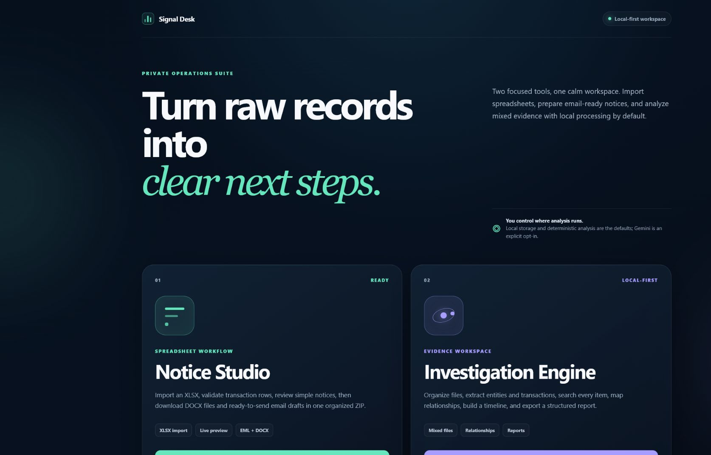
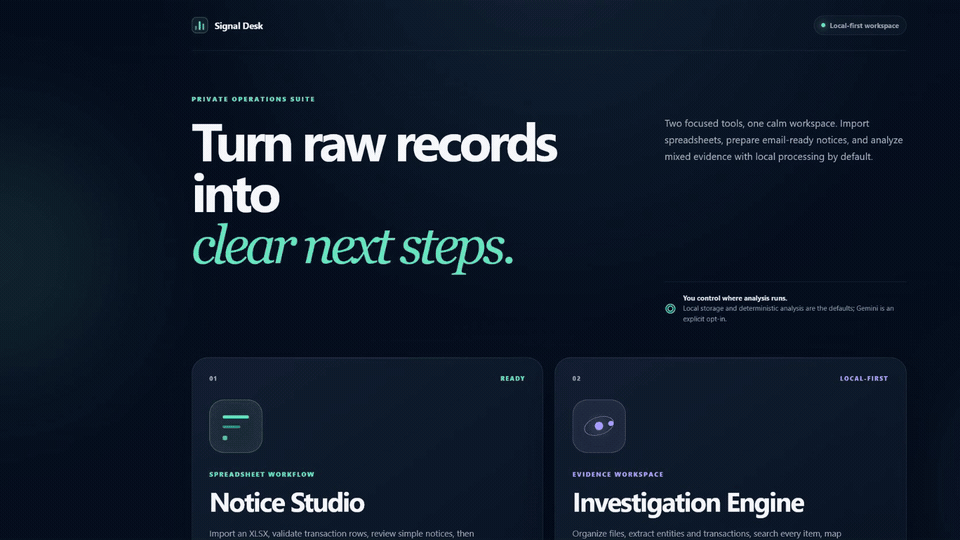
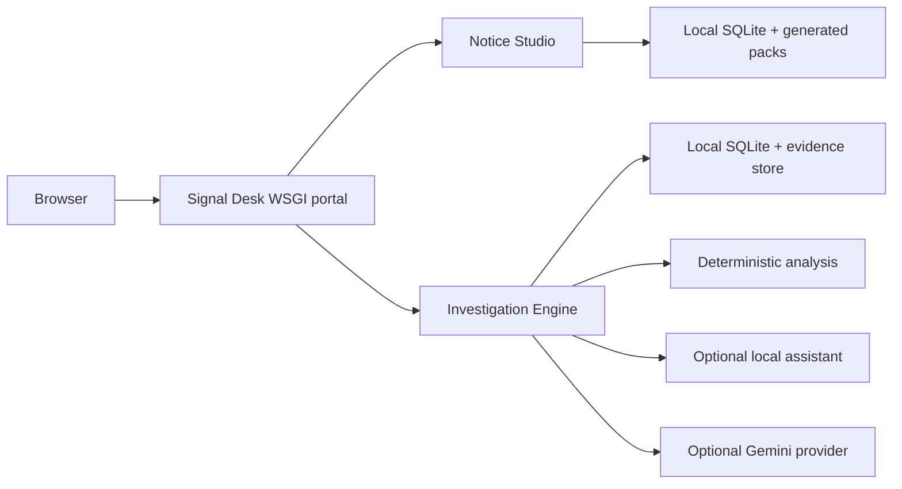

# Signal Desk

<p align="center">
  
</p>

<p align="center">
  
  
  
  
</p>

Signal Desk is a local-first operations portal for turning structured
transaction records and mixed evidence into reviewable, exportable work.
It combines two focused applications behind one Flask entrypoint:

- **Notice Studio** converts an Excel workbook into neutral DOCX information
  requests, ready-to-address email drafts and a delivery manifest.
- **Investigation Engine** organizes mixed files, extracts useful signals,
  links repeated entities, supports search and timelines, and produces
  structured reports.

Local storage and deterministic analysis are the defaults. Smart and Deep
analysis can use either a separately configured local assistant or the optional
Gemini 3.1 Flash-Lite provider.

> Signal Desk is an operational workflow tool. It does not create subpoenas,
> warrants, legal orders or professional legal advice. Review every generated
> notice and report before sending or relying on it.

## Product tour



[Download the 10-second MP4 tour](docs/media/signal-desk-tour.mp4)

## Where Signal Desk fits

### Notice Studio

Use Notice Studio when a team repeatedly receives structured transaction rows
and needs a consistent, neutral information-request workflow.

Good fits include:

- financial operations and reconciliation follow-ups;
- payment processor or vendor information requests;
- marketplace transaction review;
- internal compliance and audit correspondence;
- chargeback, dispute or customer-support escalation packs;
- batch preparation of company-specific requests from an approved spreadsheet;
- preparing individual DOCX attachments and `.eml` drafts without manually
  copying the same fields into every message.

Each generated ZIP can contain one DOCX notice and one unsent `.eml` draft per
row, plus `delivery_manifest.csv`. A missing recipient address does not block
generation; the draft can be addressed later.

Do not use it to impersonate an authority, automate legally binding service, or
send notices without checking that the organization has a valid reason and an
approved message.

### Investigation Engine

Use the Investigation Engine when information is spread across documents,
spreadsheets, screenshots, email exports, logs and other files that need to be
reviewed as one workspace.

Good fits include:

- internal fraud and transaction reviews;
- trust-and-safety or marketplace abuse analysis;
- incident-response evidence organization;
- vendor due diligence and document-heavy audits;
- customer escalation reconstruction;
- research projects involving repeated identities, accounts, URLs or dates;
- building an evidence inventory, relationship view, money trail or timeline;
- creating a structured Markdown, JSON, PDF or DOCX report for human review.

The engine supports safe extraction from common office documents, PDFs, images,
email, text, CSV/XLSX, HTML/XML, archives, code and log-like files. Available
local OCR packages determine how much text can be recovered from scanned
documents and images.

Do not use automated findings as the sole basis for legal, employment, credit,
medical or other high-impact decisions. Extracted values and AI-produced
analysis can be incomplete or incorrect and must be verified against the
original files.

## Feature overview

| Area | Included |
| --- | --- |
| Excel workflow | Column aliasing, validation, review queue, row editing and filters |
| Notice output | Neutral DOCX notices, `.eml` drafts and CSV delivery manifest |
| Evidence intake | Documents, spreadsheets, images, email, archives, logs and text-like files |
| Analysis | Entities, transactions, communications, technical indicators and social handles |
| Connections | Similarity, duplicates, repeated values and relationship graph |
| Review tools | Full-text search, timeline, summaries and exportable reports |
| AI modes | Deterministic Standard, retrieved-context Smart and Deep |
| Providers | Local assistant by default; Gemini 3.1 Flash-Lite as explicit opt-in |
| Hosting | Local Windows launcher and Vercel WSGI entrypoint |

## Privacy model

- Runtime databases, uploads and generated files are ignored by Git.
- `SIGNAL_DESK_DATA_DIR` can move both local stores outside the repository.
- Standard analysis is deterministic and calls no model provider.
- Local AI sends retrieved text only to the configured loopback assistant.
- Gemini is called only when it is configured and explicitly selected for
  Smart or Deep analysis.
- The Gemini adapter sends the question, a structured investigation digest and
  retrieved text snippets. It does not upload original evidence files.
- API keys stay server-side and are never returned by the provider-status API.

If this repository will be deployed publicly, add authentication, authorization,
rate limiting, a durable database and private object storage before accepting
real sensitive data.

## Run locally

### Windows

```powershell
.\setup.ps1
.\start.ps1
```

You can also double-click `START.bat` after setup.

### macOS or Linux

```bash
python3 -m venv .venv
source .venv/bin/activate
python -m pip install --upgrade pip
python -m pip install -r requirements-local.txt
python run.py
```

Open `http://127.0.0.1:5000`.

Install `requirements.txt` instead of `requirements-local.txt` for the lighter
Vercel-oriented dependency set. Local OCR extras are omitted from that install.

## Notice Studio workbook

Required headers:

| Header | Purpose |
| --- | --- |
| Bank | Recipient company or financial institution |
| Layer | Transaction layer/group |
| Account No | Account or destination identifier |
| IFSC | Routing code |
| Transaction Amount | Amount associated with the row |

Useful optional headers include:

- Acknowledgement No
- Transaction Date
- Transaction ID / UTR Number
- Reference No
- Remarks
- Action Taken
- Date of Action
- Company Email

Common column-name variations are accepted.

## Optional Gemini provider

Copy the example environment file:

```powershell
Copy-Item .env.example .env.local
```

Configure the server-side key:

```dotenv
GEMINI_API_KEY=replace_with_your_key
GEMINI_MODEL=gemini-3.1-flash-lite
SIGNAL_DESK_AI_PROVIDER=local
```

Restart Signal Desk, then choose **Gemini 3.1 Flash-Lite** under
**Investigation Engine → Analysis → AI analysis**. Choose Smart or Deep to call
the selected provider. Standard remains deterministic.

`.env.local` is ignored by Git. On Vercel, add the same values in Project
Settings → Environment Variables instead of committing a local environment
file.

## Environment variables

| Variable | Default | Purpose |
| --- | --- | --- |
| `SIGNAL_DESK_DATA_DIR` | Module `instance/` folders | External runtime-data root |
| `SIGNAL_DESK_AI_PROVIDER` | `local` | Initial AI provider selection |
| `GEMINI_API_KEY` | unset | Enables Gemini analysis |
| `GEMINI_MODEL` | `gemini-3.1-flash-lite` | Gemini model code |
| `GEMINI_TIMEOUT_SECONDS` | `180` | Gemini request timeout |
| `GEMINI_MAX_OUTPUT_TOKENS` | `8192` | Gemini response limit |
| `IIE_MAX_TEXT_CHARS` | `64000000` | Per-file extraction ceiling |
| `IIE_MAX_XLSX_ROWS` | `1000000` | Spreadsheet extraction ceiling |
| `IIE_OCR_LANG` | `eng` | OCR language list |

See `apps/investigation-engine/README_IMAGE_OCR.md` for optional OCR and local
vision settings.

## Deploy to Vercel

The repository includes `api/index.py`, `vercel.json`, `.python-version` and a
lightweight root `requirements.txt`.

1. Push the folder to a GitHub repository.
2. In Vercel, choose **Add New → Project** and import the repository.
3. Leave the project root as the repository root.
4. Add `GEMINI_API_KEY` only if Gemini should be available.
5. Deploy.

Vercel's function filesystem is ephemeral. The UI and request-time workflows
can run there, but durable investigations and large evidence collections need
an external database/object store. For sensitive production use, add access
control before deployment.

## Architecture



## Project structure

```text
api/index.py                       Vercel WSGI entry
portal.py                          Combined application dispatcher
signal_portal/                     Launcher UI
apps/notice-studio/                Excel-to-notice workflow
apps/investigation-engine/         Evidence-analysis workflow
shared/offline_ocr.py              Optional local OCR helper
docs/media/                        GitHub and LinkedIn media
tests/                             Contract and end-to-end smoke tests
run.py                             Local single-port server
vercel.json                        Vercel routing configuration
```

## Verification

```powershell
python -m compileall -q .
node --check apps/investigation-engine/investigation_app/static/js/workspace.js
python tests/test_gemini_adapter.py
python tests/smoke_test.py
```

The GitHub Actions workflow runs the same core checks on pushes and pull
requests.

## Publishing

Use `LINKEDIN_README.md` for prepared LinkedIn copy and media order. Use
`PUBLISHING_GUIDE.md` for the GitHub, Vercel and LinkedIn release checklist.

## License

No public license is selected in this package. Add the license that matches
your intended distribution before making the repository public.
